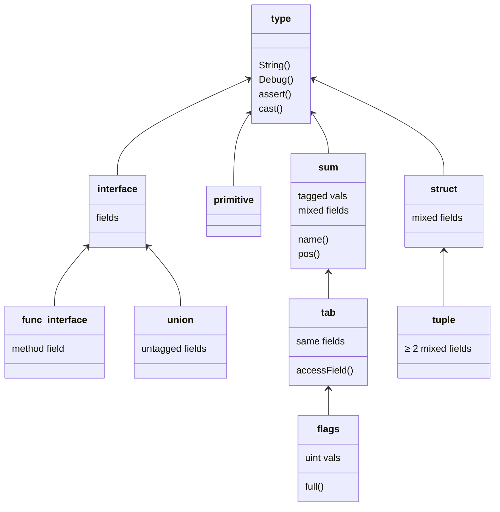

## *Remember, many of these things are pending, and waiting to be tested properly, and any of these could be scrapped or altered!*

### This doc is heavily subjected to change

In here, I explain and argue for Wo's design decisions. Maybe it could be interesting to some people, but it serves as an important documentation, so I know what has already been considered and tried.

### Index

1. [Theory](#Theory)
   1. [Background](#Background)
   2. [The goals of code](#The-goals-of-code)
   3. [To restrict or to allow](#To-restrict-or-to-allow)
   4. [Unpredictible usage](#Unpredictible-usage)
   5. [Go's design reasons](#Gos-design-reasons)
   6. [Modularity](#Why-modularity)
2. [Syntax](#Syntax)
   1. [Interface](#Interface)
   2. [For range](#For-range)
   3. [Ternary](#Ternary)
   4. [Array/Slice](#ArraySlice)
   5. [Map](#Map)
   6. [Function](#Function)
   7. [Type keyword](#Type-keyword)
   8. [Struct tags](#Struct-tags)
3. [Data Types](#Data-Types)
   1. [Set](#Set)
   2. [Option](#Option)
   3. [Complex](#i)
4. [Data Models](#Data-Models)
   1. [Tab Enum](#Tab-Enum)
   2. [Flags](#Flags)
   3. [Sum](#Sum)
   4. [Union](#Union)
   5. [Functional interface](#Functional-interface)
   6. [Overview](#Data-Models-Overview)
   7. [Algebraic types](#Algebraic-types)
   8. [Pattern Matching](#Pattern-Matching)
5. [Generics](#Generics)
   1. [Parameterized methods](#Parameterized-methods)
6. [Variables](#Variables)
   1. [Unused variables](#Unused-variables)
   2. [Variable declaration](#Variable-declaration)
   3. [Multi variable declaration](#Multi-variable-declaration)
   4. [Inline multiple values](#Inline-multiple-values)
7. [Error handling](#Error-handling)
   1. [Nil](#nil)
8. [Design](#Design)
   1. [Standard library](#Standard-library)
   2. [Variables](#Variable-naming)
   3. [Package methods](#Renaming-package-methods)
   4. [Overloading](#Overloading)
      1. [Package names](#Overloading-package-names)
      2. [Reserved words](#Overloading-Reserved-words)
      3. [Functions](#Overloading-Functions)
   5. [Import compatibility](#Import-compatibility)
   6. [Export](#Export)
   7. [Scope control](#Scope-control)
   8. [Array/Slice clarity](#ArraySlice-clarity)

## Theory

### Background

When someone makes a new programming language, it should solve a problem, not just do something that vaguely feels attractive because it combines that paradigm from that language and is based on C so it's fast.

A similar situation was Scala over Java.
Scala did something that Java wasn't providing.
It took on Java's problem of verbosity, especially with pattern matching, and, importantly, interoped with Java.

I have not seen anything in the programming language landscape like that: **a direct child of Go that addresses design**.
This project differs by modiifying the same compiler and compiling both languages at once.

And let it be known that the internet is full of needless speculation as to "why Go did this and not that?".
I'll be skeptical of any justification that people give to Go and make this design process transparent.
I prioritize the "objective" best way of doing something regardless of what the theories originally purported.

In other words, **this is about what happens in practice, not how logically sound or nice the theory is behind it** -
or how bad you think it would be, which is just obstinance without actually trying it.

*Trying something* is how you came to like programming in the first place, isn't it?

For example, Vim sounds crazy on paper to people the first time they hear of it, thinking "but why can't you type by default!?", but only once they start to try it out do they realize that it's incredible to use in practice.
Or, hypothetically, they end up realizing it's terrible, and they simply enjoy hurting their hands with the arrow keys.

Obviously, the design I end up going with is going to be heavily influenced by my opinions, but I'm actually trying to base it on what I percieve as universal as well as delicately balanced.


Additionally, the entire band of questions such as "wasn't it designed for bad programmers?" are irrelevent here.
Whataboutisms like that which lead one astray from the real goals of programming language design are not the main topic here.
Tip: it's a fallacy because something is what it is whether someone intended for it to be something or not (but it could give clues into its design as it is anyway, but people don't ask that question for that reason).

In terms of design, positions like "we have to do something because it's... fast, short, nice, efficient, what I'm used to, what I'm not used to, new, follows a principle" are all invalid, non sequitur arguments.
For example, there are times when being slow is the better decusion, such as to sacrifice for security.

It's a massive balance that's hard to keep track of, but you should never have to rely on "only following an established principle". Obviously it's dogmatic and will just lead to a mess of inconsistency.
Getting this right is actually a massive multidimensional game of minimax. You have to take a step back to see if we can redo everything for the better, if not then we pick the best option given our downsides, repeat for each option... in other words, we will have to sacrifice x for y. We HAVE to, and we do make decisions like that constantly.

Please, I want any discussions about project and concept to be focused on design and programming. Even this introduction area is fringey. Some of these topics could even be contentious, but I don't want it to distract us from legit debate and discussion. Programming is what matters; don't let unfriendliness and grudges remove you from that. I want to be democratic, but I also want to be weary of the wisdom of the crowd effect fallacy. For example, it's hard to vote on which feature is better when you haven't even tried them, so polls should be done for a very particular kind of topic.

However, ultimately, additional programming capabilities can be more valuable in some circumstances, while it doesn't matter in others.
For example, I had a Java program that simplifies math expressions, and making that [one file](https://github.com/Branzz/DiscreteMath/blob/scala_integration/src/bran/tree/compositions/expressions/operators/OperatorExpression.scala#L452) into Scala out of the whole project shortened [that code](https://github.com/Branzz/DiscreteMath/blob/scala_integration/src/bran/tree/compositions/expressions/operators/OperatorExpression0.java#L223) by about 2.5 times as much because of pattern matching, but all the other files were fine being Java.

So it is just nice to have the option of a design that is attuned to your circumstances, as opposed to some forced grifting replacement for all of Go that must be better because the author thinks so.

That's why I am planning to make the features modular / able to be swapped in and out with some kind of attribute.

Despite my use of the first person, that is just to make it easier to understand this situation.
When in reality, **<ins>this is not really my project. It's open.</ins>**
It'll eventually be put into "we decided" and "Wo does" if others contribute.
Anyone can contribute with issues, pull requests, or even maintaining.
I will never be dismissive with pull requests even if I don't like the change, in order to be iterative and experimental (branches exist).
We will finalize on something as long as it is the best option granted the downsides. It should clearly follow good language design.
If it's something controversial, then it can just be a feature that's off by default - who cares?

This project should be very unbackwards-compatible during its infancy at least, but please try it out for the sake of interest.

### The goals of code

Code communicates and guarantees that it achieves something when ran by a computer. These two fight with each other in ways I won't be able to describe fully here. Intention seems to be an important part of Go's design, and I believe it is important. Just keep this in mind for later.

I believe that adding comments is to compensate for code that doesn't communicate. They should be rarely used in practice, only used deliberately for things like magic constants and documentation. Even with documentation, it should be obvious what a function is going to do from its name. The syntax and style of a language along with the programmer's design of the code, such as identifier names and logical design, all contribute to the given "intent" of the program. Therefore:

**The compiler should not force you to be unnecessarily vague.** Preferably, it should help you to be clear. When it does give you the ability to write vague and bad code, you should personally avoid it, like in variable names and abstractions.

It's our job to pay attention to details, but let's still make it as easy on ourselves as possible.

Go's style design recommends using vague variable and function names. I give an elaboration of this in [variable naming](#Variable naming). This isn't exactly a criticism, but just a description of how Go appears to me.

Boilerplate actually is good by the way, but only when it holds up to all of our established code standards: readable, giving intent, functional, not much slower, etc. It's one extreme to make 5 functions with the only difference being a string literal inside rather than making that a parameter. However, on the other hand, code isn't meant to be just run, it's meant to be used and edited - the code base grows in unpredictable directions, and it grows off of that previously placed boilerplate. And, it serves to not overly compress useful language.

The `if err != nil {}` pattern doesn't really satisfy that description of a useful boilerplate above. If something is important and constantly modified (besides the err check body, which does have different variations), it shouldn't be shortened, but if something is not very significant to your overall goal of the program, and it is repeated across many programs, this is prime for abstraction.

A Similar thing is true with `set`s. You will very rarely need a modified implementation, so it should be a standard type. How many times have you had to create your own set implementation when one was already provided when it wasn't for a data structures class or for fun? Personally, exactly once, which was when I implemented it here in this project.

### To restrict or to allow

Should we allow bad language and hope that users don't use it? Or should we completely ban it...

When I choose a syntax, it has to not already exist, or if it exists, in an unmistakably different context. If the most obvious or common choice is used elsewhere, or if it would confuse the compiler, then I will consider a syntax that seems completely foreign. All programming syntax was foreign at first, and plenty of people try out new ways of writing things that they hate at first and end up getting used to and enjoying. If you can't adapt to something like that (granted the syntax isn't atrocious), modern programming probably isn't right for you.

For example, Learning Go 2nd edition says:

> Note: The Go compiler won’t stop you from creating unread package-level variables. This is one more reason you should avoid creating package-level variables.

This is backwards logic to me from the compiler's perspective. It shouldn't allow you to do something that you shouldn't do.

### Unpredictible usage

I want to eliminate "memorized arbitrary facts" or, simply, unpredictability.

We should learn what `.` and `if` mean to start since the base components of language aren't going to be intuitive, but some things are completely arbitrary given the context.

It's not obvious that `map`s and slices are pointers.

It's not obvious what each of the zero values are. If a string starts as `""`, then slice should start as `{}` if we are trying to be predictable.

The meaning of `nil` isn't obviously determined.

In Go, you can call getters on unititialized maps, but not setters. They are both initialized as `nil`, since that's their zero value, but the way you use them ends up being different since `append(nil, ...)` on slices, but not `nilmap[key] = v`.

There is unexpected slice appending behavior.

Obviously, you have to learn this from a book, documentation, or experimenting, just like a lot of other things in programming, but I'm saying you shouldn't have to do that for very certain unobvious things given you are used to the language at hand. It should be obvious even after you've learned it. These situations should be intuitive based on their appearance and programmatic context. `slice` could return extra information about what has happened to make it less vague for example.

### Go's design reasons

When people try to answer this online, like on Stack Overflow, there are a mix of reasons provided for the language decisions with Go, with a mixed supposed underlying principle behind these. On Go's FAQ however, it's quite more straight forward, though, and it's useful here.

Besides the obvious reasons of "having a good feature that lets you program", [their FAQ](https://go.dev/doc/faq#Design) has these categories of justifications

- Prevention of a feature because it:
  1. Makes compiling easier to implement
  2. It can be or always is
     - confusing
     - convoluted
     - unreadable
     - harder to use
  3. So they have to think about something important instead
  4. Slow
- Inclusion of a feature because it:
  1. Was fine in practice
  2. To replace a prevented feature

They don't go too far into depth on what exactly makes something readable or not, but I'm going to analyze it for each syntactical design feature.

*To be continued*

### Why modularity

I am considering making different language features **modular**. That is, they can be enabled or disabled either through a compiler flag, in the module file, or with some file header.

This isn't the newest idea, as languages all have versions one can choose of their liking. Rust has that capability with something like `#![allow(unused)]` which allows unused variables in the entire file.

If someone just likes only the interface syntax, and that's all they want, then they can still use Wo in that way without dealing with the parts they don't like.

For example, enforcing the type before the variable name is universally disagreed on, so this could just be an additional option, not the Wo default. If a feature isn't restrictive, then it doesn't need a flag.

That means there are these types of features: Those enforced without an option which are naturally optional, those that are on by default, those that are off by default. Experimental or "very indifferent" ones would be the ones that are disabled by default.

## Syntax

### Interface

I chose `<T>` for `interface{T}`. I considered something like `~T`, but you can't wrap around with that. There was also `#{}`, but the shortness of `<>` was more attractive. Angled brackets are a symbol that are not used in Go and are already associated with types.

```go
func f[T <>, S <bool>]() { }
```

As for

```go
type I interface {
    bool
}
```

If I follow the same suit, it ends up being

```go
type I <
    bool
>
```
which is a bit weird unless you really like C++. Using `interface` in the type declaration doesn't feel exasperating anyway.

So I'll keep `type Name interface {}` for now.

For the union syntax, the `<>`, let alone the `interface{}` around some union type can just be dropped:

```go
type floaty = float32 | float64
```

Also see [union](#Union).

### For range

The default `for range` syntax is
```go
for i, v := range nums {
    sum += v
}
```

It's basically an enhanced for loop. `range` isn't used anywhere else, and it's not like you can assign a variable as a range. I think they needed `range` because `i, v := nums` alone is misleading since that doesn't actually return the index and value, but we can just get around that by doing what Java did back when I was a baby:

```go
for i, v : nums {
    sum += v
}
```
as `:` is given a new meaning.

Note that this will use the **value** by default for a single variable

`for value : nums {}`

In Go, when there is a single variable declared, it is for the index

`for index := range nums {}`

I see this as "memorized information"; it's arbitrary. There's no way of knowing whether it's "for the indices in the range of a collection" or "for the values in the range of a collection" without seeing it before. Since people are used to that way, switching it could be confusing, but I don't really want to rely on something like that when my goal is to offer an alternative design. Additionally, `for value : values` is the common pattern seen in other languages anyway, so it shouldn't really be surprising that `for i : values` isn't actually the index when taken out of the context of Go.

I chose to make it the **value** by default as it would be more common and intuitive as one seems to want to ignore the index by nature of using the enhanced "for an item *in* items", possibly opting for a traditional `for i = 0; i < len; i++` otherwise, or just using `for i, _ : values {}` for access to the index.

- That could be problematic when frequently using this when trying to modify arrays or slices by their index, so range could be kept to mean "range of indices over"

### Ternary

There is `?:` and `if else`, but let's look at more possibilities

In Go,

```go
var hvac
if indoorTemp < outdoorTemp {
    hvac = heating
} else {
    hvac = ac
}
```

could also be represented with

```go
var hvac = if indoorTemp < outdoorTemp { heating } else { ac } // no parens
```

or

```go
var hvac = if (indoorTemp < outdoorTemp) heating else ac
```

or

```go
var hvac = indoorTemp < outdoorTemp ? heating : ac
```

Despite the first one being the longest, I think I'll go for that one since it is consistent with the `if cond` no parentheses style that Wo already has (which was inherited from Go). Another way around the parentheses problem is to do something like this

```go
var hvac = if indoorTemp < outdoorTemp then heating else ac // imagine then is highlighted
var hvac = if indoorTemp < outdoorTemp ? heating else ac
var hvac = if indoorTemp < outdoorTemp ? heating : ac
var hvac = heating if indoorTemp < outdoorTemp else ac
```

Since it is an expression, an important question is what these look like when applied at more depth

```go
var hvac
if indoorTemp < outdoorTemp {
    if thermostat > indoorTemp {
        hvac = heating
    }
    hvac = none
} else {
    if thermostat < indoorTemp {
        hvac = ac
    }
    hvac = none
}

var hvac = if indoorTemp < outdoorTemp { if thermostat > indoorTemp { heating } else { none } } else { if thermostat < indoorTemp { ac } else { none } }
var hvac = if (indoorTemp < outdoorTemp) if (thermostat > indoorTemp) heating else none else if (thermostat < indoorTemp) ac else none
var hvac = indoorTemp < outdoorTemp ? thermostat > indoorTemp ? heating : none : thermostat < indoorTemp ? ac : none
var hvac = if indoorTemp < outdoorTemp THEN if thermostat > indoorTemp THEN heating else none else if thermostat < indoorTemp THEN ac else none
var hvac = if indoorTemp < outdoorTemp ? if thermostat > indoorTemp ? heating else none else if thermostat < indoorTemp ? ac else none
var hvac = if indoorTemp < outdoorTemp ? if thermostat > indoorTemp ? heating : none : if thermostat < indoorTemp ? ac : none
var hvac = heating if thermostat > indoorTemp else none if indoorTemp < outdoorTemp else ac if thermostat < indoorTemp else none
```

and also with else if

```go
var hvac
if indoorTemp == outdoorTemp {
    hvac = off
} else if indoorTemp < outdoorTemp {
    hvac = heating
} else {
    hvac = ac
}

var hvac = if indoorTemp == outdoorTemp { off } else if indoorTemp < outdoorTemp { heating } else { ac }
var hvac = if (indoorTemp == outdoorTemp) off else if (indoorTemp < outdoorTemp) heating else ac
var hvac = indoorTemp == outdoorTemp ? off : indoorTemp < outdoorTemp ? heating : ac
var hvac = if indoorTemp == outdoorTemp then off else if indoorTemp < outdoorTemp then heating else ac
var hvac = if indoorTemp == outdoorTemp ? off else if indoorTemp < outdoorTemp ? heating else ac
var hvac = if indoorTemp == outdoorTemp ? off : if indoorTemp < outdoorTemp ? heating : ac
var hvac = off if indoorTemp == outdoorTemp else heating if indoorTemp < outdoorTemp else ac
```

Hmmmm... Surprisingly, I don't think any of these are vague to the compiler given you go by right to left associativity.

And no, you really shouldn't be making ternary statements ridiculously complicated, but I need to make sure those are still parsable and still readable.

I know the last one is weird, but it is actually very interesting. It goes like this: "if (A) {B} else {C}" &#8594; "B if A else C". It ends up in a binary tree shape. You can still read it left to right in plain English. For example, "if you know C, your life is great" can also have it phrased as "your life is great if you know C", but places slightly more emphasis on the value than the condition.

It also avoids some of the vagueness of

`var hvac = indoorTemp == outdoorTemp...`

seeming like `var (hvac = indoorTemp)` at first glance.

I'll combine the `else if` with the further depth: `var hvac = off if indoorTemp == outdoorTemp else heating if thermostat > indoorTemp else none if indoorTemp < outdoorTemp else ac if thermostat < indoorTemp else none`

The hvac is off if it's the same temperature indoors as it is outdoors, otherwise it's heating if the thermostat is higher than the indoor temperature, otherwise it's no hvac if the indoor temperature is lower than outdoor temperature, otherwise it's AC if the thermostat is lower than the indoor temperature, otherwise it's none.

That syntax could also be nice for short assignments like

`value = dereference(input) if input.isPtr() else input`

I'm also kinda interested in the one with "then" since it does make reading it more obvious without requiring `()` or `{}`.

However, I think that first basic option is the most readable since you can clearly see the depth level with the curly braces.

But it's *just* the curly braces that make it easy to read for me. How about I apply them to the other ones despite being redundant (to be thorough):

I'll combine the two: `var hvac = { off } if indoorTemp == outdoorTemp else { { heating } if thermostat > indoorTemp else { { none } if indoorTemp < outdoorTemp else { { ac } if thermostat < indoorTemp else { none } } } }`

I find this kinda weird. Next:

`var hvac = indoorTemp == outdoorTemp ? { off } : { indoorTemp < outdoorTemp ? { thermostat > indoorTemp ? { heating } : { none } } : { thermostat < indoorTemp ? { ac } : { none } }`

That's ok, but why not just use `if`/`else` in place of those:

`var hvac = indoorTemp == outdoorTemp if { off } else { indoorTemp < outdoorTemp if { thermostat > indoorTemp if { heating } else { none } } else { thermostat < indoorTemp if { ac } else { none } }`

I should only stray from the most obvious variation of Go when it's a clear improvement over the status quo. Idk if these really are, I personally like them, but I can already hear the angry voices insisting any of these are evil. Which points to a bit of a reality here: nothing will only be praised, and nothing will only be shamed...

I'm going with `v = 2 * (if cond { a } else { b }) + ` for now, despite the curly braces feeling EXASPERATING to add in.

I'll do this by either adding an expression identical to the `if else` statement, or modify the statement to become an expression.

### Array/Slice

I've concluded that it's not feasible to use `arr[]` because of how it interacts with map.

Map is declared and called like this:

`m := map[k]v`

`v := m[k]`

but array is declared and called like this:

`a := [x]arr`

`x := a[i]`

The odd one out is `[x]arr`, which has the array marks as a prefix. What if it were the suffix?

For example, what about a slice of a map from keys of 4 bytes to values of (maps with keys of 2 bytes to values of slices of strings)
```
[]map[[4]byte]map[[2]byte][]string     // Go
map[byte[4]]map[byte[2]]string[][]     // arr[] --- vague
map[[4]byte, map[[2]byte, []string]][] // map[A, B]
map[byte[4], map[byte[2], string[]]][] // map[A, B] and arr[]
```

The second one is ambiguous, since it could mean a double array of strings, which doesn't happen when we use `map[A, B]`

The last one prefers depth, so it ends up pushing more symbols to the end.

For arrays and slices, I say either keep [ ]arr with map[A, B], or just don't make any changes

### Map

I think `map[key]value` is supposed to reflect the `func(input) val` pattern, as well as the `value = map[key]`, but there is nothing about the fundamental concept of maps that imply they should reflect the "return type afterwards" pattern. If anything, `map[key]` should not necessarily mean "get", it could have meant `contains` or `indexOf` as arrays do with `[index]`. `get(key K) V {}` will already represent the function format, since it is just a function. There aren't many other options besides `map[key, value]`. However, I think Go's is still better in practice.

I think this is too disruptive and unnecessary of a change as shown in the previous section, so I'll keep `map[key]value`

### Function

The `func(P) R` syntax is fine at fixing C's spiriling function types, and, in the case of its instantiation, takes up a lot of space for minimal meaning when it's being used in function arguments.

People often cite `->`, but I looked at other styles later. There are way more variations than you'd expect, so don't spend too much time thinking about that.

I want to keep `func` for multi line function calls, since that is much more similar to what functions actually look like anyway, as functions have multiple lines and curly braces while the anonymous function doesn't.

```go
s -> {
  s.bury(nuts)
  return s.runUpATree()
}
```

is just a bit awkward in comparison to

```go
func s() {
  s.bury(nuts)
  return s.runUpATree()
}
```

since the first line of the function doesn't need to be shorter with `->` since it has already been split up into multiple lines anyway.

Now, for the simple case, which:

`map(c -> c + 1)`

in comparison to

`map(func(c int) { return c + 1 }`

This requires: `func`, the parameter types (`int`), curly brackets `{}`, and the `return` keyword, while the right arrow syntax requires `->`.

Of course, for Wo's function literal syntax, it will not require the types unless it's absolutely needed. In this case, the compiler knows `c` is an `int` in the same way that it knows what it is in the body of `func f(c int) { c + 1 }`.

There is also wishes to keep `func` in the lambda. This option wouldn't change any of the analysis below, so it can be considered. Also see https://github.com/golang/go/issues/21498#issuecomment-2477240860

For function types, the only problem I've noticed with it so far is that the parameterless returnless type is longer and the tuple type can look like arguments, except this is never syntactically vague to the compiler since the tuple can only be the last thing in any series of parameters and returns.

Here are a lot of different cases:

| `func`                                 | `->`                                 |
|----------------------------------------|--------------------------------------|
| `func()`                               | `() -> ()`                           |
| `func(T)`                              | `T -> ()`                            |
| `func() T`                             | `() -> T`                            |
| `func(T) T`                            | `T -> T`                             |
| `func(func())`                         | `(() -> ()) -> ()`                   |
| `func(a A) (b B)`                      | `(a A) -> (b B)`                     |
| `func(func(T) T) T`                    | `(T -> T) -> T`                      |
| `func(T) func(T) T`                    | `T -> T -> T`                        |
| `func() func(T) T`                     | `() -> T -> T`                       |
| `func() func()`                        | `() -> () -> ()`                     |
| `func(a A) func(b B)`                  | `(a A) -> (b B) -> ()`               |
| `func() func() func()`                 | `() -> () -> () -> ()`               |
| `func(func()) func()`                  | `(() -> ()) -> () -> ()`             |
| `func(func(T) T) func(T) T`            | `(T -> T) -> T -> T`                 |
| `func() (T, T)`                        | `() -> (T, T)`                       |
| `func(func() (T, T))`                  | `(() -> (T, T)) -> ()`               |
| `func(T, T) (T, T)`                    | `(T, T) -> (T, T)`                   |
| `func(T) (func(T) T, func(T) T)`       | `T -> (T -> T, T -> T )`             |    
| `func(a T) (func(b T) T, func(c T) T)` | `(a T) -> ((b T) -> T, (c T) -> T )` |    
| `func() (func(), func())`              | `() -> (() -> (), () -> () )`        |

I'm using `->` to replicate "returning" and so `=>` could be reserved for pattern matching, but here are some other styles I kinda like:

| `func`                             | `->`                              | `:`                               | `_`                             | `λ`                          | Remove `func`             | No arrow                    |
|------------------------------------|:----------------------------------|:----------------------------------|:--------------------------------|------------------------------|---------------------------|-----------------------------|
| `func()`                           | `() -> ()`                        | `() : ()`                         | `_ : _`                         | `λ`                          | `()`                      | `_ _`                       |
| `func(T) T`                        | `T -> T`                          | `T : T`                           | `T : T`                         | `λT T`                       | `(T) T`                   | `T T`                       |
| `func(f func())`                   | `(f() -> ()) -> ()`               | `(f() : ()) : ()`                 | `(f _ : _) : _`                 | `λ(f λ)`                     | `(f())`                   | `(f _ _) _`                 |
| `func(func(T) func()) T`           | `(T -> () -> ()) -> ()`           | `(T : () : ()) : ()`              | `(T : _ : _) : _`               | `λ(λT λ)`                    | `((T) ()) T`              | `(T _ _) _`                 |
| `func(T, T) func(T) T`             | `(T, T) -> T -> T`                | `(T, T) : T : T`                  | `(T, T) : T : T`                | `λ(T, T) λT T`               | `(T, T) (T) T`            | `(T, T) T T`                |
| `func(a A) func(b B) (c C)`        | `(a A) -> (b B) -> (c C)`         | `(a A) : (b B) : (c C)`           | `(a A) : (b B) : (c C)`         | `λ(a A) λ(b B) (c C)`        | `(a A) (b B) (c C)`       | `(a A) (b B) (c C)`         |
| `func(func(T) T) func(T)`          | `(T -> T) -> T -> ()`             | `(T : T) : T : ()`                | `(T : T) : T : _`               | `λ(λT T) λT`                 | `((T) T) (T)`             | `(T T) T _`                 |
| `func() (T, T)`                    | `() -> (T, T)`                    | `() : (T, T)`                     | `_ : (T, T)`                    | `λ() (T, T)`                 | `() (T, T)`               | `_ (T, T)`                  |
| `func(L) (func(M) N, func(O) P)`   | `L -> (M -> N, O -> P)`           | `L : (M : N, O : P)`              | `L : (M : N, O : P )`           | `λL (λM N, λO P)`            | `(L) ((M) N, (O) P)`      | `L (M N, O P)`              |
| `func c(d func(x, y int)) (z int)` | `c(d(x, y int) -> ()) -> (z int)` | `c(d(x, y int) -> ()) -> (z int)` | `c(d(x, y int) : ()) : (z int)` | `λ c(d λ(x, y int)) (z int)` | `c(d (x, y int)) (z int)` | `c(d(x, y int) ()) (z int)` |

For completion, Js does `function(a){}`, Python does `lambda a: a`, C++ does `[](T t) -> R {}`, Rust does `Fn(T) -> T`, `|a: i32| a`. There are still many, many other ways it could be done.

There's some serious potential with these other designs.

`:` reduces the arrow by a character, but it can be conflated with tags like in maps or slicing.

`_` takes away a char from `()`, but it looks similar to the "unused signifier", like `_ -> int` could mean "ignore the input". I would have to disable `_` as a variable name.

`λ` is cool since you can easily count and see how many functions there are, and it doesn't need any indicator of a return type, like how `func()` was, but it is restrictive to Greek identifiers, and `λT` is even an identifier on its own already.

Removing `func` allows stuff like `f(g(int) int)`. However, this means `T` and `(T)` have different meanings, but wrapped parens shouldn't change the meaning so easily for a single identifier.

But I think these examples aren't as practical to show how some of these styles could shine.

To eliminate them carefully, the removed `func` and lambda symbols are too impractical. The `:` and `_`'s are fine really, I just need to make sure it can compile that. Without any arrows, `x Type` is conflated with `x -> Type`.

Therefore, my favorite is `_ :`, but I do miss not having to specify the void return type. I like that because you don't actually "`return`" in the function itself, so the function signature need not say something like `void`. Maybe in those cases, you should just use `func()`.

Through testing, I've discovered that it's better if you can tell the difference between empty parameters and an empty return, since they are fundamentally different. In literals, the empty return changes, while the empty parameter doesn't.

With some function with side effects, `e(...)` and a function that creates a `T`, `ter()`, here are examples with literals.

| `func()`         | `_ -> _`          | `_ ->`         | `() -> _`         | `() -> {}`          | `() ->`       | `fn()`      | ` -> `       | `_ -> e()`          | 
|------------------|-------------------|----------------|-------------------|---------------------|---------------|-------------|--------------|---------------------|
| `func(T)`        | `T -> _`          | `T -> `        | `T -> _`          | `T -> {}`           | `T ->`        | `fn(T)`     | `T -> `      | `T -> e()`          |
| `func() T`       | `_ -> T`          | `_ -> T`       | `() -> T`         | `() -> T`           | `() -> T`     | `fn() T`    | ` -> T`      | `_ -> ter()`        |
| `func(T) T`      | `t T -> _`        | `t T -> `      | `t T -> _`        | `t T -> {}`         | `t T ->`      | `fn(t T)`   | `t T -> `    | `t -> ter(t)`       |
| `func(func())`   | `(_ -> _) -> _`   | `(_ -> ) -> `  | `(() -> _) -> _`  | `(() -> {}) -> {}`  | `(() ->) ->`  | `fn(fn())`  | `( -> ) -> ` | `(_ -> e()) -> e()` |
| `func() func()`  | `_ -> _ -> _`     | `_ -> _ -> `   | `() -> () -> _`   | `() -> () -> {}`    | `() -> () ->` | `fn() fn()` | ` -> -> `    | `_ -> _ -> e()`     |
| `func(a func())` | `(a _ -> _) -> _` | `(a _ -> ) ->` | `(a() -> _) -> _` | `(a() -> {}) -> {}` | `(a() ->) ->` | `fn(a())`   | `(a -> ) ->` | `(a -> e()) -> e()` |

I like how `()` as the parameters lets the variable name work like the name of the function, which matches how it's called. Therefore, `() :` is my favorite.
As cool as `->` is, having an empty paramater type could be really weird with names like in the last row.
The main problem is that when they are named, like `var a ->`, `a` is too similar to a parameter.
As well as `func(f T)` and `f func(T)`, both looking like `f T -> T` But, I think it's fine with the return empty removed if we use `f(T)` for function names and `f T` for parameters.
Except, it feels very vague whether it's returning anything like that with no return symbol, so I say `() ->`.

| `func()`                               | `() ->`                            | `_ : _`                             | `_ : e()`                                       |
|----------------------------------------|------------------------------------|-------------------------------------|-------------------------------------------------|
| `func(T)`                              | `T ->`                             | `T : _`                             | `t : e(t)`                                      |
| `func() T`                             | `() -> T`                          | `_ : T`                             | `_ : ter()`                                     |
| `func(T) T` with func                  | `func T -> T`                      | `func T : T`                        | `func t : ter(t)`                               |
| `a func(b T) T`                        | `a(b) -> T`                        | `a(b) : T`                          | `t : ter(t)`                                    |
| `func(func())`                         | `(() ->) ->`                       | `(_ : _) : _`                       | `(_ : _) : e()`                                 |
| `func(a A) (b B)`                      | `a A -> b B`                       | `a A : b B`                         | `a : ber(a)`                                    |
| `func(func(T) T) T`                    | `(g(T) -> T) -> T`                 | `(g T : T) : T`                     | `f(t : ter(t)) : f(unwrap)`                     |
| `func(T) func(T) T`                    | `T -> T -> T`                      | `T : T : T`                         | `q : r : ter(q, r)`                             |
| `func() func()`                        | `() -> () ->`                      | `_ : _ : _`                         | `_ : _ : e()`                                   |
| `func(a A) func(b B)`                  | `a A -> b B ->`                    | `a A : b B : _`                     | `a : b : e(a, b)`                               |
| `func() func() func()`                 | `() -> () -> () ->`                | `_ : _ : _ : _`                     | `_ : _ : _ : e()`                               |
| `func(f func()) func()`                | `(f() -> ()) -> () ->`             | `(f _ : _) : _ : _`                 | `(_ : e()) : _ : e()`                           |
| `func() func(func())`                  | `() -> (() ->) ->`                 | `_ : (_ : _) : _`                   | `_ : (_ : e()) : e()`                           |
| `x func(y func(z func()))`             | `x(y(z() ->) ->) ->`               | `x(y(z _ : _) : _) : _`             | `((_ : e()) : e2()) : e3()`                     |
| `func(func(T) *T) func(T) *T`          | `(T -> *T) -> T -> *T`             | `(T : *T) : T : *T`                 | `(t : terp(t)) : s : terp(s)`                   |
| `func(interface{T \| S}) interface{}`  | `T \| S -> <>`                     | `T \| S : <>`                       | `ts : xer(ts)`                                  |
| `f func() (T, T)`                      | `f() -> (T, T)`                    | `f _ : (T, T)`                      | `_ : (t, s)`                                    |
| `func(func() (T, T))`                  | `(() -> (T, T)) ->`                | `(_ : (T, T)) : _`                  | `(_ : (t, s)) : _`                              |
| `func(T, T) (T, T)`                    | `(T, T) -> (T, T)`                 | `(T, T) : (T, T)`                   | `(t, s) : (s, t)`                               |
| `func(T) func(T) (T, T)`               | `T -> (T -> (T, T))`               | `T : (T : (T, T))`                  | `t : (s : ter(s), ter(t))`                      |
| `func() (p func(), q func())`          | `() -> (p() ->, q() -> )`          | `_ : (p _ : _, q _ : _ )`           | `_ : (_ : e(), _ : e())`                        |
| `func(T) (func(T) T, func(T) T)`       | `T -> (T -> T, T -> T)`            | `T : (T : T, T : T)`                | `t : (s : ter(t, s), u : ter(t, u))`            |
| `func(a T) (func(b T) T, func(c T) T)` | `a T -> (b T -> T, c T -> T)`      | `a T : (b T : T, c T : T)`          | `a : (b : ter(a, b), c : ter(a, c))`            |
| `func(T, T) (func(T, T), func(T, T))`  | `(T, T) -> ((T, T) ->, (T, T) ->)` | `(T, T) : ((T, T) : _, (T, T) : _)` | `(p, q) : ((t, s) : e(p, t), (x, y) : e(p, y))` |

For literals, if it actually wants to return nothing like `->_` or `->` instead of an explicit call like `noop()` in the literals, it could be a no-op by default to have it empty.

In a similar way, it's hard to tell between parameters and tuples. I tried to distinguish between them by dropping the parantheses on the tuple, but leads to impossible situations.
And, I noticed that it was interesting to type using this style since I did have to think about types and literals very carefully, but it did feel unnecessarily weird at times.

Mandatory check, is it literally readable? I think you can. For example, `_ : T : T` means like `take nothing and return a function that takes T and returns T` and `(sa T) : ((ri T) : T, (ga T) : T )` is like "take sa which is a T and return a pair of a func that takes ri which is a T and gives a T with a func that takes ga which is a T and returns a T"
, but I would still say that `(sa T) -> ((ri T) -> T, (ga T) -> T )` is clearer.

After trying out `_ : _`, it was actually kind of hard to get used to, so I like `(A, B) -> (_ -> R, S) -> _` the most. It feels the most simple and obvious when reading it.

In terms of implementation, I am not worried about this, since I can easily change that once I figure out how to do it, so I will just implement `_ -> _` and if it obviously becomes annoying, then come back to this.

---

How should generics interact with shortened function types? Well, how do they interact with Go's types? It doesn't really given that we are only shortening function types as they are used in values, since generics are only used in actual `func f()` declarations. There is nothing that says we can't use this syntax with func declarations, but the limitation is that you can't put type parameters in function types. Besides that, a shortened literal could be passed into a type that was declared as a function, however, so I don't think this is a big problem right now.

Let's get some fuller examples to get a feel of this syntax when the symbols have significant meaning.

Simple example:

```go
var wrap func() = func() { op() }
var wrap() -> = () -> op()
wrap()
```

Map:

```go
var Map func(string) int = func(s string) int { return s.Length() }
var Map string -> int = s -> s.Length()
```
Optional, based around monad pattern:

```go
// without currying
var or = func(o Opt, other func() Opt) Opt {
    if o.isPresent() {
      return o
    } else {
      return other()
  }
}
var or(Opt, () -> Opt) -> Opt = (o, other) -> if o.isPresent() then o else other()
or(get() -> or(retrieve() -> or(create() -> orElse(none))))

// with currying
var or = func(o Opt) func(func() Opt) Opt {
  return other func(func() Opt) Opt {
    if o.isPresent() {
      return o
    } else {
      return other()
    }
  }
}
var or(Opt) -> (() -> Opt) -> Opt = o -> other -> if o.isPresent() then o else other()
get().or(retrieve()).or(create()).orElse(none)
```

### Type keyword

Going for this syntax is a real possibility, but I don't see it necessary or too helpful (either way):
`struct S {}`
`interface I {}`,
so I'm keeping that.

### Struct tags

```go
type Pear struct {
  name string `tag:"the name"`
  size int    `tag:3`
}
```

*To be continued*

## Data Types

In general, having a term like `set` while also preventing reserved words from being overloading can make the language difficult to use. Especially since `set(v)` is a likely function name.

> Why are maps built in?
>
> The same reason strings are: they are such a powerful and important data structure that providing one excellent implementation with syntactic support makes programming more pleasant. We believe that Go’s implementation of maps is strong enough that it will serve for the vast majority of uses. If a specific application can benefit from a custom implementation, it’s possible to write one but it will not be as convenient syntactically; this seems a reasonable tradeoff.

There isn't anything inherently significant about the keywords `map` or `len`; it can just be represented by a struct or function. So it's down to just making a language nicer. I'm also proposing `enum`, `some`, and `none`. I don't think this is crossing the line yet of having to consistently and annoyingly rename things like class to clazz yet, but that does feel like a dishonest representation of a program when renamings like that have to happen, since the restriction is coming from a meta syntactical problem, not a functional one.

### Map


*To be continued*

### Set

Implementing this really wasn't too interesting or challenging, but it was tedious.

Because of the way `map` is designed (a hashmap), the keys and values are stored rather insignificantly, and removing the values from its structure was pretty simple to do. There isn't anything special about the difference between key and value besides that one part gets hashed and one part doesn't. So, yes, I copied map and refactored it; I really don't think there is any faster way to do *this map* for *its* intended purposes without also improving hashmap. That wasn't really my intention with Wo, but if someone sees a way of seriously improving the native hashmap when it doesn't have values, or if I spot an obvious one, then let's go ahead. I haven't changed the time complexity, but it should technically be insignificantly faster than `map[]struct{}`.

So I made `map`'s keys as `set`'s elements, wiping any functionality with `map`'s values.

This does mean the removal of the `val = m[key]` method, as that doesn't really mean anything for sets. Instead, I modified and kept the `_, ok = m[key]` method, using it like `ok = s[elem]`.

```go
primes set[int] = { 2, 3, 5 } // declaration
has = primes[4]               // if has elem
```

I am not sure about `s[e]` being on the left hand side. Removing it means removing something from what `map` could do, but at the same time, removing it implies that it has a removed functionality from `map`, which it does: it doesn't have values.

But why does `map` use specifically that syntax? Well, it matches what slices do, where the setter and getter follow the same pattern:

```go
val = wordMap["mel"] // getter
wordMap["mel"] = val // setter

delete(isPrime, "roc")
```

To avoid any unnecessarily unfamiliar syntax, we could model sets off of how they are usually achieved:

```go
booly = wordSet["sal"] // getter
wordSet["sal"] = booly // setter/remover

delete(wordSet, "apl") // also a remover
```

One problem is that it implies that the set is paired with booleans, when it really isn't. However, it could be more adaptable to pre-existing APIs and methods, although that shouldn't be our primary factor.

I'm going to go ahead and keep it, but it's a hard call. Ultimately, it keeps that reflection with the getter and initializer, and I feel like this functionality would be missed. I would also say it is intuitive. It also can't really create bad or even unreadable code, it just seems a bit inconsistent with the meaning of a set.

It makes sense to also the boolean as a remover, it's actually similiar to how maps originally did it.

Although I prefer add and remove, I kept it as delete and insert for consistency.

If I were crazy, I would use something like `s += elem` for adding an element.

Technically, it is like this: `Add(primes, 7)`, but I plan to create shortcut "semi methods" to do that.

There are also fast versions of the map for `string`, `int32`, and `int64`, which Wo also has.

It also supports a `sets` package in the same way that `maps` works.

Sets in math use `{ }` to mean "unordered, unique collection", but in Go, which uses EBNF, it means "ordered, repeatable collection". I think it is ok to use the curly brackets for sets, since it is programmatically ordered and repeatable data at first, but then it will become converted from that explicit representation into something which is guaranteed to be an actual set. I can actually still say `{ a, b, a, c }` in math, but it represents a set of `a`, `b` and `c` without order. It is also predictable with the formatting already used with arrays and maps. If someone made their own set or any kind of math collection, it'd use the curly brackets.

### Option

Here are a couple designs:
```go
type Option1[T any] interface {
  none    // = some 0 sized type
  some(T) // = T
}

type Option2[T any] struct {
  exists bool
  t T
}
```

Option1 can't do type assertion or type switch, requiring some kind of handler like `errors.Is`. It can do `some` / `none` pattern matching easier. Option2 can do field embedding, which is pretty important to errors, but it could probably still work with some native implementation details. It also aligns more with the idea of returning structs, however that principle is not as strong for the case of this interface.

It should support functional programing and error handling like [lo](https://github.com/samber/lo) and [mo](https://github.com/samber/mo)

Once `enum` is implemented, then this should just be a sum.

```go
type Option[T] enum {
  Some(T)
  None
}
```

(I picked `Option` instead of `Optional` because it's shorter, and they can both have booleany existence connotations)

I originally thought about making `some` and `none` reserved words, but they already follow the common pattern of an enum, and those are capitalized.

There a lot more design decisions when it comes to this. This may imply the necessity of a Box.

Another question is whether to allow `?` and `!`. The downside is that it's short, but I haven't had any troubles noticing it. It also implies that the optionality and errability of stuff is a native part of the language, and we should think about it in those terms. Which, it is, there are countless cases of `(T, bool)` and `(T, error)` being returned and unwrapped.

A problem with it is that something like `*` and `&` are pairs. But these have no pairs, so the type is also the thing that unwraps its own type. As long as we don't use `val?` for initializing an Option and instead use initializers such as `Option.of`, `Some(T)`, `None`, `Ok(T)`, `Err.of`, or `Err(e)` (I haven't decided the function names yet), then I think nothing would overlap in meaning.

#### ImpureOption vs Nilable Option

nil/zero value can mean none or something special depending on your situation, so

`Some(nil)` could eval to `None` in some contexts,

but we have to detetrmine when that would happen like with `Option.OfNilable(nil)`

Option and Result are a solution to the "nilable" problem.

*To be continued*

#### ok

To solve the problem of interoperating with Go code, if any function from the standard library or any Go file has something like

`func f() (X, bool)`

It'd be really impractical to go through and change all of those, especially when it also exists in 3rd party packages and your own Go code in the same project.

So, this can be _interpreted_ as an Option[X]. It's impossible to know if that's what it actually meant without some code analysis, but it can still be treated like a tuple anyway. 

In Wo code, the type must **explicitly** be "`Option[X]`" or "`X?`" to be treated like one, and the tuples get treated only like tuples.

```go
func get() (int, bool) {} // std lib or Go file

func use() { // 
  fmt.PrintLn(get()?, get().isPresent(), get().) 
}
```

In other languages, `?` is a way of unwrapping, so it could be confusing to use something like `func f() T?`, so I'll go with the more explicit `func f() Option[T]` for Wo.

These ideas with err will also apply to ok, since this also represents an optional.

I could also mirror errors with `func h() T!`, but they shouldn't be stacked with each other like `func j() T?!` since the `ok` pattern is like a softer version of an error. Errors imply existence of the values as do `ok`s, just without the implication of an error happening.

## Error Handling

### `nil`

Before talking about error handling, I'll brief about `nil` in general.

I believe the billion-dollar mistake spawned from the need to represent uninitialized variables and unknown references.

Null isn't really a thing in byte code land. It's a high level concept to cover up something happening. What null actually represents to the byte code side could be anything, but it's often just a 0, something unallocated, or it's just removed by the time it reaches byte code. In other words, null isn't real, it's part of the veil of the type system.

> What nil indicates for a variable with an interface type is whether you can invoke methods on it. As I covered earlier, you can invoke methods on nil concrete instances, so it makes sense that you can invoke methods on an interface variable that was assigned a nil concrete instance. If an interface variable is nil, invoking any methods on it triggers a panic (which I’ll discuss in “panic and recover”). If an interface variable is non-nil, you can invoke methods on it. (But note that if the value is nil and the methods of the assigned type don’t properly handle nil, you could still trigger a panic.)
>
> Since an interface instance with a non-nil type is not equal to nil, it is not straightforward to tell whether the value associated with the interface is nil when the type is non-nil. You must use reflection (which I’ll discuss in “Use Reflection to Check If an Interface’s Value Is nil”) to find out.
>
> Learning Go

In summary, `nil` has been given more meaning. There are two levels of `nil` for interfaces, one is the type and one is the value. For the interface type, you can't call methods on it if that is `nil`, but you can call methods on a `nil` for regular types if the method is using a pointer receiver or if the value is `nil` and the interface type isn't, but you have to use reflection in that case. This discrepancy exists because of how Go manages interfaces by keeping track of type information and wrapping the actual value.

These were just some examples of the meaning of `nil` in the context of how it functions in the language, but it can also mean *anything* that the programmer wants. For example, from Go's source code:

```go
if pkg == nil {
  pkg = nopkg
}
```

This has happened with error handling, although it is an agreed upon standard.
> We believe that coupling exceptions to a control structure, as in the try-catch-finally idiom, results in convoluted code. It also tends to encourage programmers to label too many ordinary errors, such as failing to open a file, as exceptional.

Sure, but you don't need to overcompensate. An error doesn't deserve multiple extra lines to remind you, even more than the main plot. Errors are still secondary, basically an after-thought, for better or for worse (Yes, I dream of a language with errors in mind first). A miniscule check is actually enough, since you don't need to be constantly reminded by it as it is not essential to the flow of the logic of your code, while still letting you ask "is this error checked?" and then easily seeing that it is because you're looking for it. This situation is not one typical of over abstraction, it's a perfect example of something that should be reduced to improve readability by highlighting what matters

Go has an interesting way of going about errors. Its primary goal is to strictly treat them as values.

This means that there is an `error` type that gets passed through return values and into variables. No wonder it has tuples. It's often returned as a value, as opposed to "being thrown", although they aren't too far apart in practice. panic is much closer to a serious exception being brought up.

> `error` is a value.

Sounds alright until you add:

> `error` is a value, and it not being `nil` means there is an error.

---

What error handling should Wo have?

Representing and dealing with errors by some other structure that
1. Has significant and consistent purpose in the language that doesn't impede the development process, and
2. Compiles to equal or better machine code.
   is a worthy design.

For that, we have:

1. Go's current system is one contender.
2. And there's the counterpart to the `error` value pattern is the `option` or the more thorough `result`.

We have learned our lessons from many languages in the past.

Let's wager for the best thing we can design with our constraints.

#### if err != nil

I know this debate goes in circles. Why don't we all just try out something new to see what it's like in practice, that's what computer science is about, right? I'll offer some options.

Here's the common example:

```go
f, err := os.Open("hi.wo")
if err != nil {
    return nil, err
}
```

There are common shortcuts to do error checking:

```go
if err := doer(); err != nil {
  return error
}
```

and

```go
token, err := scanner.Scan()
check(err)
```

...but we could use an alternative syntax like:

```go
var token = scanner.Scan()!
```

I was originally considering `scanner!Scan()` since the actual symbol of `!` is like a variation of `.`, but the compiler got it confused with the not symbol without a package identifier: `!Scan()` looks too much like "Not (Result of Scan)".

Now here are a bunch of other options:

```go
var file, log("Error:", err)   = os.Open("hi.wo")
var file, handle(err)          = os.Open("hi.wo")!  // handle and throw
var file, return(none, 3, err) = os.Open("hi.wo")   // with other return values
var file, if(err)              = os.Open("hi.wo") { handle(err) } // similar to Swift's `try?`
if var file                    = os.Open("hi.wo") { /*main code*/ }    // Swift/Rust
var file                       = os.Open("hi.wo")!! // panic
var file                       = os.Open("hi.wo")?  // unwrap or panic
var file                       = os.Open("hi.wo").orElse(newFile)
var file                       = os.Open("hi.wo")? else newFile // experimental
var file                       = if os.Open("hi.wo")? else newFile // experimental
```

The ultra-shortened version removes some choice you get with error-handling, but you can still shorten that pattern as well as having this option.

I'm going to decide against the single line function calls around the variable since this could just be on the next line. The reason I had that was to pair it with `!`, but it's still a bit odd to read.

I'll settle with these:

```go
var file = os.Open("hi.wo")!
try var file = os.Open("hi.wo") { /*main code*/ }
try file.Close() { } // try without return value
var file = os.Open("hi.wo")!! // panic
var file = os.Open("hi.wo").orElse(newFile)
var file = switch os.Open("hi.wo") {
  case Ok(f) => f
  case Err(err) => { handle(err); newFile }
}

if val, ok := table["e"] {}
if var val = table["e"] {} // "try var" for err and "if var" for opt
```

I don't think `nil` should represent that an error didn't happen.

A higher representation of the meaning of `nil` in the context of errors would be:

```
err == nil: no error occured
err != nil: an error occured, and err is the description of the error
```

It could be represented by calling something like "err.didError()".

which aligns with the semantic meaning of "whether an error happened or not" more.

#### Func signature

Additionally, errors are bound to functions, as they are something that can happen when a function is ran. This means we could generalize it further by signifying that some function can return an error:

```go
func a() res {}
errable func b() res {}
```

Or maybe

```go
func b() errable res {}
```

if it is the function's result which is to reveal the error.

If we combine it with the option pattern, it would be equivalent to

```go
func b() res? ^ error? {}
```

where ^ means xor, as in, either a result or an error.

which is basically just an interface or struct like

```go
type Errable[T any] struct { // tell me if you miss "Result"
  value T
  err   error
}
type Errable[T any] interface {
  value() T
  error
}
type Errable[T, E error] enum {
   Ok(T),
   Err(E)
}
```

which is equivalent to `Option[error]`.

For example

```go
func div(a, b int) (int, error) {}
if quotient, err := div(a, b); err != nil {
  return err
}
```

in Wo, could be written as:

```go
func div(a, b int) Errable[int] {}
func div(a, b int) int! {}
quotient int = div(a, b)!
	
// or with more handling
var quotient = div(a, b).orElse(NaN)

if var quotient = div(a, b) {
  quotient = NaN
}
var quotient = switch div(a, b) {
  case q   => q
  case err => NaN
}
var quotient = try div(a, b) { NaN }
```

...and is converted to the effect of:

```go
func div(a, b int) Errable[int] {}
quotient int = 0
var quotientOrErr = div(a, b)
switch quotientOrErr.(type) {
  case error:
    return quotientOrErr.(error)
}
quotient = quotientOrErr.value()
```

and is indeed about the same thing as a `Result` or `Option`. So I've naturally came to the same conclusion as just using that pattern with some custom syntactical sugar.

The big difference here between implementing it yourself and customizing the compiler is that I can take existing functions and interpret them as a Result.

Like, this standard function,
```go
func Open(name string) (*File, error)
```

in some Wo file could be interpreted like this:

```go
func Open(name string) errable *File

var file = os.Open("README.md")!
```

---

Another aspect of error handling is extending them.

> Errors are an exception to this rule. As you’ll see in Chapter 9, Go functions and methods can declare a return parameter of the error interface type. In the case of error, it’s quite likely that different implementations of the interface could be returned, so you need to use an interface to handle all possible options, as interfaces are the only abstract type in Go.
>
Learning Go 2nd

---

Also, for interoperability, a Wo file can interpret a Go-sourced import such as `func GoGet() (int, bool)` as `func GoGet() Option[int]` where `Option[T]` is just `<T, bool>`, but not within that Wo file. So you must explicitly use the type in the return signature in Wo code like `func WoFunc() T?` to reserve `(T, bool)`.

And the same thing is true for Errable too: `func GoDiv() (int, error)` can be interpreted as `func GoDiv() Errable[int]` where Errable is just `<T, error>`. It should be written like `func arcsin() float!` in Wo code.

And finally Go files compiled with the Wo compiler will interpret these in reverse from a Wo file as how Go typically does it, however it can share the same underlying `Option` and `Errable` types.

### i

`x := 5 - 3i`

I vote to keep this since this is cool and kind of funny. It doesn't intersect with any other syntax.

The odd part is that it allows mixed ints and floats.

## Data Models

### Tab Enum

In reality, there will be 3 types of enums. This is the basic, common enumeration type to start.

A typical enum is replicated in Go like this:

```go
type Day uint8

const (
  Sunday Day = 1 + iota
  Monday
)

var names = [...]string {
  Sunday: "Sunday",
  Monday: "Monday",
}

func (day Day) root() string {
  switch day {
    case Sunday:
      return "sun"
    case Monday:
      return "moon"
    default:
      panic("not a day of the week")
  }
}

func (day Day) working() bool {
  switch day {
    case Sunday:
      return false
    case Monday:
      return true
    default:
      panic("not a day of the week")
  }
}

func test() (string, uint8, string, bool) {
  return names[Monday], Sunday, Monday.root(), Sunday.working()
}
```

To replicate this same thing with an enum model,

```go
type Day enum {
    Sunday("sun", false)
    Monday("moon", true)

    root    string
    workday bool
}

func test() (string, uint8, string, bool) {
 return Monday.name, Sunday.val(), Monday.root, Sunday.working
}
```

It should maybe be `name()` and `pos()` or `position`.

In order to separate the instances from the fields, I could either use commas, which is inconsistent, or it could be two blocks:


```go
type Day enum { // matches the other definition styles
    string // untagged type
    workday=true bool // default value
}

const ( // based on iota decl block
  Sunday("sun", false) Day
  Monday("moon")
)

```

Default values also have to be addressed for the case of enums.

Usually, I'd imagine that the enum instances have to all be declared in the same block or at least the same file.
But, I guess they technically don't as long as there are no overlapping names in scope and their order isn't being relied on, which would either give some useful control or remove some necessary restriction.

In my case, I do want their order to matter, and Go's current strategy allows you to have multiple enum constants declared as the same value and in different places.
They could also be `var`, but I want enum logic to happen statically, purely at compile time.

The idea is that the actual values of the constants are hidden to the programmer since they are magic numbers that don't really have much meaning,
and we are just replicating flags by the underlying type of some unsigned int. It could also be represented with an actual set of values or an array of booleans for example.
It could even be "compiled away" completely. The underlying implementation details aren't important to the general user.

The one problem with this is that you can and would create sum enum values anywhere else dynamically, unlike flags or enum constants. I will just have them work differently there.

If there are loads of default values, and especially unused values, then it should probably be adapted to a sum type.

### Flags

The `const` and `iota` syntax is also used to replicate flags with bit flipping. If the concept of `iota` is to be done by `enum`, then it should also be able to do flags.

There does exist a syntax for that in C#:

```cs
[Flags]
enum Permissions {
  Execute = 1,
  Write   = 2,
  Read    = 4
}
```

It also lets you choose the type of the number, like `enum Settings : byte {}`. In my case, I will make the default the smallest possible unsigned int, but maybe they should be allowed to change it like by declaring `val int32`. It should be an implentation detail though, so it'd make more sense for them to use their own definition like `func (e E) MyVal() { 2 * e.val() - 1 }`.

I can not think of any good syntax for flags other than just doing what all the other types do.

```go
type Permissions enum {
  Execute
  Write
  Read    // = 4
}
```

If an enum has no fields, then it should be assumed to also be flags. I could also do `type Permissions flags`, but it is unnecessary here, as this is a distinct form of `enum`. I'm not really a fan of using `interface` for different types, but at least you can tell them apart still.
If the enum has more fields than its int type can hold, then it'd have to be represented differently either by the compiler or programmer.

They should probably just be evaluated to their regular number type and have bit operations done on them as usual.
Taking for granted that you already know how bit math works,
if there are any cases that bit operations are not necessarily intuitive regarding the concept of flags,
then other syntax could be used besides the bit operations.

Some utility could be provided so that something like `if perms == 0b111 {}` could have an alias `Permissions.All` which just fills every bit for every constant.

It should still provide the type safety of not allowing the comparing of values across different flag types.

`Execute | Write` and `Read & (ReadWrite)` make sense on their own, and Go even has `ExecuteRead &^ Read`, so I think it is fine.

### Sum

The sum type is like Rust's enum.

```go
type Direction enum {
  Cardinal(int8)
  Vector(x float32, y float32)
  Origin
}
```

It can still use `enum` like the first two since this is clearly different from the regular enum as it isn't just fields, and it's different from flags since the instances have fields.

### Enum overview

Since these `enum` types share characteristics, their hierarchy would look like this:

Sum <- Enum <- Flags

Since they each use `enum` and one is also called enum, I wish for a way to differentiate it. I natuarally began calling it "regular", but this could just mean "any kind of" enum, so I have decided that a "tab" ("tabulation", "tabular", "tabulate", "table") is a good way of representing it, since a tab is (oftened keyed) rows with columns of data per row. The columns here being the enum constant name and the fields.

So, with the example from earlier, this would be a tab:

| Day     | root   | workday |
|---------|--------|---------|
| Sunday  | "sun"  | false   |
| Monday  | "moon" | true    |
| Tuesday | "tyr"  | true    |

which matches very well with the standard concept of an enumeration.

To implement these enum types, the data structure for sum and tab should work like the union but tagged.

That means the table above could be equal to a final `(root string, workday bool)`, and a sum would be like a final `(int8) | (x float32, y float32) | ()`

### Union

First, there is alse the question of whether the `union` keyword is needed, since these two are equal:

```go
type pos = int | [2]int

type pos union {
  int | [2]int
}
```

If `type t =` is to maintain not allowing generics, then the full union syntax could be used.

However, a concern with unions and the sum type is generics. This could use the same format that `struct` does:

```go
type list[T: int | rune] union { // there are technically 2 unions here
  []T | string
}
```

It is difficult to handle internally since an array of ints and an array of strings are just different things. Julia accomplishes this by nesting the types in the union's type like so:

```go
type list union {
  []int | []rune | string
}
```

since the types of `int` and `string` are distinct.

```go
func calcBMI[T int | string, S int](height T, weight S)
```

https://github.com/golang/go/issues/19412

### Functional interface

`interface{f()}` &#8594; `<f()>`

### Data Models Overview

Currently, this overall design has lead to 7 different data models. For reference (depending on how you count it), Go has 3, Rust has 4, C has 4, and Java has 5, so it is certainly more than average. However, the goal isn't to have a lot of types of course.
As long as they are each distinct and useful in their own circumstances for that language with barely any overlapping meaning, then this is fine and actually good. Especially when it's replacing a common pattern or not-very-extendable boilerplate that's already done in that language often, which would result in less complexity.

| Property                 | `struct`/tuple     | `interface`           | Union `interface`    | Functional `interface` | Tab `enum` (Wo)                               | Flags `enum` (Wo) | Sum `enum` (Wo)                      |
|--------------------------|--------------------|-----------------------|----------------------|------------------------|-----------------------------------------------|-------------------|--------------------------------------|
| Tagged                   | Optional           | Optional              | No                   | Optional               | Yes                                           | Yes               | Yes                                  |
| Inner Type Decl Content  | Types              | Methods/Types         | Untaggedt Variant    | Method                 | Final Instances and Methods/Types             | `uint`s           | Tagged Variants                      |
| Inner Decl `type X _`... | `{ int\ *string }` | `{ int\func walk() }` | `{ int16 \| int64 }` | `{ hash() int }`       | `{ moons int } const X { Earth(1), Mars(2) }` | `{ R\W\Ex }`      | `{ None\Num(int)\Big(string) }`      |
| Value `var t = `...      | `{5, &"C++"}`      | `3` or `walkable`     | `10`                 | `func hash() ...`      | `Earth`                                       | `Wood \| Brick`   | `None` or `Big("999")`               |
| Algebraic Symbol Usage   | `([]int, string)`  | `<Walk(), Find()>`    | `float32 \| int32`   | `func()` or `<f()>`    | `Arabic(false) + Latin(true) + Greek(true)`   | `N + S + W + E`   | `Out(sea int) + In(mountain string)` |
| Algebraic Concept        | Product $×$ AND    | Abstract Product?     | Union $∪$ OR         | Abstract Product?      |                                               |                   | Sum $+$                              |
| Mutability               | Mutable Fields     | Immutable Methods     | None                 | Immutable Method       | None                                          | None              | None                                 |
| Ordered                  | Partially          | Unordered             | Unordered            | N/A                    | Ordered                                       | Ordered           | Ordered                              |
| Polymorphic              | None               | Subtypes              | From Variant         | Subtype                | None                                          | None              | From Variant                         |
| Inheritance              | None               | Yes, Embedded         | None                 |                        | None                                          | None              | None                                 |
| Comparable to            | Go                 | Go                    |                      | Go                     | Java Enum                                     |                   | Julia / Rust Enum                    |

A hierarchy of these types given their characteristics and native methods:



Here's a full example taking advantage of each of these types properly (Example [go](https://github.com/wo-language/wo-info/blob/main/examples/go/datamodels.go) and [wo](https://github.com/wo-language/wo-info/blob/main/examples/datamodels.wo) file):

```go
type Camera[I Image] struct {
  model  CameraModel
  memory []I // can't be enum field since it's mutable and instance specific
}

type CameraModel enum {
  brand Brand
  ViewFinder

  A7R_IV(Sony)
  D300S(Nikon(D | S, 500))
  Z9(Nikon(Z, 9))
}

type Brand enum {
  Sony
  Nikon(NikonSeries, level uint8)
}

type NikonSeries enum { // e.g. Nikon D70, D300S, D2XS, E2NS
	Z, D, H, X, A, E, N, S // 1, 2, 4, 8...
}

type ViewFinder enum { // can be any of these with the values filled in, if there are any
  None
  Optical(magnification float32)
  Electronic(magnification float32, height, width int)
}

type Image interface {
  [][]uint32 | [][]uint8
}
```

And an example usage of this system:

```go
func (camera *Camera) String() string {
  return fmt.Sprint(camera.model, " with ", memory.Len(), " images")
}

Camera{ A7R, []Image{} } // "Sony A7R with 0 images"
```

In an interface type that targets Camera's model field, CameraModel can't be abstracted since it's that unique enum type, but union and interface can be embedded contracts.
That is, some enum instance from some other enum with a `Brand` and `ViewFinder` fields can't be used as the type of `CameraModel`,
while some other union that isn't called `pixelGrid` with a satisfying type can still be used for some `Image` instance, or even anything included in the type of `pixelGrid` such as `type bitmap = [][]uint8` or just `[][]uint32` itself.

However, it should be possible to achieve some sort of generic enum, or perhaps enum could satisfy some other generic, besides just the easy case of its methods in the same way that a struct can do it.

Enums already have shared behavior: the `name` and `position` fields/methods. Writing utility for enums in general could be desired.

In this case, it should probably be intentionally restricted, since there is probably something pretty wrong with your own program if you are abstracting different enums being used in place of one another. However, if it turns out that this is a common and needed feature with more mileage, then obviously it should be implemented.

And the same goes for structs since they similarly have fields.

### Algebraic types

What if we extend the Union type syntax with the other set symbols as above? Would it still make sense? would it be useful? Other languages can do this, but let's see how that would work with Go's system.

Also see: https://go.dev/ref/spec#Type_unification

It is already possible with union, but I think it can be done with structs and sums. Enum could be weird when it has field info.

I'll start with `interface`. The only way this exists as a shortened algebraic type is as a union, but not for its other mode of method contracts.

```go
type Node interface {
  next Node
  val() int
}

type Siner = <Sin() float64>
type Node = <Node, func() int>
```

Combining just union and sum:

In the same way that `&&` < `||`... `+` < `|` < `,` in Go's precedence.
So `A || B && C` means `A || (B && C)` and same for `A | B + C, D` = `(A | (B + C)), D`

```go
type Singleton = int                         // type
type LowInt    = int8 | int16                // union
type BigInt    = Num(string) + Inf(neg bool) // sum
type LowBigInt = LowInt | BigInt             // union(union, sum)
   []LowBigInt{int8(5), Num("-0.1111"), Inf(false)}
type DynInt    = BigInt + Low(LowInt)        // sum
type SuperInt  = DynInt | [4]int64           // union(sum, type)
type Combo     = Singleton | BigInt | (NaN + Float(float32 | float64)) // union(type, type, sum)
   []Combo{9, Singleton(-9), Num("9"), NaN, Float(9)}
type NoParens  = []int | A + B               // union(type, sum) + is lower precedence

type Parens    = A + (int | float)   // sum(tagged, union) - compile error, sum(untagged union)
type SumPrece  = []int | float + B   // union(type, sum(type, B) - compile error, type is not tagged
type SingleSum = SoloSum(error)      // solo sum - compile error
type OrSum     = int | Tagged(float) // union(type, solo sum) - compile error
type PlusSum   = int + Tagged(float) // sum(untagged, tagged) - compile error
```

All of this actually makes a lot of sense to me. It's really easy to read when you comprehend what union and sum mean.

#### Wrapping types in a sum

A common thing done with sums is just wrapping a single type, when it could actually be just fine being untagged, like so:

```go
type FiberCable, RJ45, CellTower // pre-existing types

type Connection enum {
  Fiber(FiberCable),
  Ethernet(RJ45),
  Cell(CellTower),
  LAN(port uint16),
  WAN(port uint16),
  Unconnected,
}
type ConnectionUnwrap = FiberCable | RJ45 | CellTower | LAN(port uint16) + WAN(port uint16) + Unconnected
```

These two represent the same thing, and since something like `FiberCable` is unique and obviously corresponds to its own unique member within the different kinds of `Connection`s, they can be unwrapped. The `port` was not unique, though, and had to be contained or wrapped around a higher tagged sum type along with the `Unconnected` option.

#### Algebraic struct

Here's with the "cartesian product", `struct`, which should use `,`. The type `struct{...,}` and literal `struct{...,}{...,}` already exist, but let's drop the `struct{}` and combine it with the other types.

```go
type Version = name string, code, year int8 // product
type Model   = Regular(Version) + Unversioned(alt string) // sum
type Unit    = mileage DynInt, model Model
type Expand  = mileage Km(int) + Miles(int) + Num(string) | float32, model string | Reg(Version) + Unversioned // struct(union, union)
```

The last one is a bit excessive and is probably better as a full `struct`.

This is just like the tuple type but without parens, which makes perfect sense. This is basically just allowing tuples as a type beyond the return type. All the same logic would follow; tuples can also be null and have methods.

I think it should always have parantheses. This also differentiates it with tuple literals.

```go
type Walk = (distance float32, StayedHome + Outdoors(destinations ...string))
var a Walk = (4.4, Outdoors("Crystal Cave", "Sepia Shop", "Clastic Cliff"))
var b Walk = (0.2, StayedHome)
```

```go
type Point1 struct {
  x, y int
}
type Point2 = (x, y int)

func (point *Point1) mag() { x, y = point }
func (point *Point2) mag() { x, y = point.x, point.y }
var p1 = Point1{2, 4}
var p2 Point2 = (2, 4)
```

As you can see, these function in the same way with the difference being the unwrapping and creation syntax.

There may also have to be a generic type for them like `(int, int)` to go with `struct{ fields }`.

#### Algebraic regular Enum

Recapping, there are three kinds of enums. The tab enum has the most complex definition block, so should it be allowed in shortened algebraic type notation?

It could be interesting to have a quick one line enum or within a simple field like `Reader(In(int) + Out(int))`, but it will probably be awkward as something embedded in the rest of the types.

It should use a symbol with a lower precedence than the rest so that it's contained to its own area. The only binary operators left below `+` are `* / & &^ << >>` or any of the unused ones if really needed.

```go
type Flip = On / Off // flags enum (can still work as a sum)
type Grade(min int) = A(90) / B(80) / C(70)
type Features = codeExample string, feature string | Generics(tokens "[]", version "1.18") / Sync("sync atomic", "1.22") / DateOnly("DateOnly", "1.20"), link URL | string
```

The single type one is ok, but it being combined with others is really pushing it, and it doesn't have an identifier. If there ends up being a very good way to write it, then fine.

To reflect how they are both declared with `enum`, they should just both use `+` like this

```go
type FlipFlag = On + Off
type Flip = On() + Off()
type Test = (unit int, A(90) + B(80) + C(70))
```

which is the same thing as

```go
type FlipFlag enum { // flags
    On, Off
}
type Flip enum { // sum
    On(), Off()
    // no fields
}
type Flip struct {
    unit int
    Grade 
}
type Grade enum { // tab, previously had no name
    int // anonymous
    A(90), B(80), C(70)
}
type Test struct {
    unit int
    Grade
}
```

Note that, in the same way that a struct can't have two anonymous string fields, it can't have two anonymous enum fields. It is fixed by just naming it.

I'm tempted to enforce it in the multi line declaration when the values are all on one line, since that's how interface union already works, like

```go
type NikonSeries enum {
  Z + D + H + X + A + E + N + S
}
```

I feel like a concern is, "what if the programmer puts a ton of really long names on the same line?". They could do that, but they can already do that with structs and interfaces, and they can also name things terribly as they wish. They can also just write bad code.
In this case, I think it's not the compiler's responsibility to determine if the length of the number of identifiers or arguments is readable or not.

#### Example

Here's the section earlier with the types that can be shorthanded:

```go
type Camera[I Image] = (model CameraModel, memory []I)
type Branded = <brand Brand, name String>
type Brand = Sony + Nikon(NikonSeries, level uint8)
type NikonSeries = Z, D, H, X, A, E, N, S
type Image = [][]uint32 | [][]uint8
```

### Pattern Matching

This talk of sum and union begs the discussion of pattern matching.

It should be supported.

```go
type Length enum {
    Cm(float32)
    M(float32)
    FtInch(int, float32) 
}

func (length Length) ToInches() float32 {
    return switch length {
        case Cm(cm) => cm / 2.54
        case M(m) => m / 0.0254
        case FtInch(ft, in) => float32(ft) * 12 + in
    }
}
```

Switch-case could also be an expression as shown here.


## Generics

Here are some limitations of Go generics. These aren't necessarily unnecessary limitations, and they could be serving as something deliberately useful. If I change the rest of the type system, all of this does need to be looked at too though.

- Generics type params for struct or interface methods
- Generic struct, e.g. `interface{int, string}`
- Variadic generic `[T ...int]`
- Interface constraints as types
- Covariance
- Overload/implement methods by different constraints
- Default type params
- Embedding type params

https://github.com/golang/go/issues/57644#issuecomment-1372977273
https://github.com/golang/go/issues/70752
https://github.com/golang/go/issues/49085

### Parameterized methods

The description [from Google](https://go.googlesource.com/proposal/+/refs/heads/master/design/43651-type-parameters.md#no-parameterized-methods) isn't entirely close ended:

> This design does not permit methods to declare type parameters that are specific to the method. The receiver may have type parameters, but the method may not add any type parameters.
> 
> In Go, one of the main roles of methods is to permit types to implement interfaces. It is not clear whether it is reasonably possible to permit parameterized methods to implement interfaces.

It then gives an example that makes this argument: A type `S` with a `Func[any]` that matches an interface `H` with a parameterized method `Func[any]` could be called in a different scope than `S.Func` as: `S.(H).Func[int]`, which needs to be instatiated.

It provides some solutions: Instantiate it at link time. Instantiate it at runtime, which may use JIT. And, make it not implement the matching interfaces. Out of all of these, the last seems the most sensible.

Of course, we can just disable type casting if it really needs to be, or making it slow and safe at least, while still opting for whatever's left over.

#### Mixed

Receivers of the same type shouldn't be suggested to be either all pointers or all values. The programmer finds that out as they design and adapt their program.

### Generics in type

```go
type[T] Something = interface{T}
```

This is the aliastypeparams Go experiment. Since it's pending, I'll wait until then, or just make the experiment included in Wo.

## Variables

### Unused variables

```go
func main() {
    var x = 3 // error: Unused variable 'x'
}
```

Wo would simply allow this. It will become a warning and compiled away. The reason Go doesn't do this is probably because of how it optimizes variables. It does allow unused `const` for the same reason, since those are easier to optimize. However, it is not otherwise impossible to optimize unused variables away.

### Variable declaration

Go offers these styles of declarations:

```go
//z := 1 // not possible at package level
func declares() {
 var a int = 1
 var c = 1
 d := 1
 var e int
 var (
     // all the same things it could already do
 )
 var m, n int = 1, 2
 var q, r = 1, 2
 s, t := 1, 2
 var u, v int
 
 e = 2        // possible, just assigns
 e, y := 2, 3 // possible
 if d == 1 {
     d := 2   // possible
     m, n := 3, 4 // possible
 }
 // at this point,
 // d == 1
 // m, n == 1, 2 
 
 // note: e was already declared (we wouldn't need this note if shadowing were more explicit)
 e := 2       // not possible
 e, _ := 2, 3 // not possible
 
 b int := 1 // not possible
 f int // not possible (unlike C style int f;)
 var X // not possible
o, p int := 1, 2 // not possible
w, x int // not possible
 
 fmt.Println(a, b, ... x, y) // haha
}
```

Let's reduce this down as much as possible to rules for describing what's above. I'll use a logical grid strategy.

```
var a, _ int = 8, 9  var ( b = 8 )
var c string         var ( d, e string )
f := 10              a, z := 10
const g int = 8      const ( h = 8 )
f, _ = 10, 11        c = "aoeu"
```

R - Required, ! - None, ? - Optional, # - Other

Each column will represent these in order. So the last column of this grid represents an assignment

```
const  ! ! ! R !
var    R R ! ! !
(...)  ? ? ! ? ? // var ( a = 1, ... )
names  R R R R R
  :=   ! ! R ! !
types  ? R ! ? !
litral ? ? ? R ?
  =    R ! ! R R
values R ! R R R
at pkg ? ? ! ? ?
multi  ? ? R ? ? // a, b =
shadow ! ! # ! ?
count  2 1 2 2 2

var names (type  |  (= values))  |
var \( (names (type  |  (= values)))... \)   |
name := value {not in package level}

// where names is really (name | (name | _)...)
```

That adds up to 9 main possibilities by ignoring literal, package, multi declaration, and `( ... )`

For C, it would be like this, ignoring anything that became all disallowed

```
prefxs ? ! (const, volatile, static)
types  R !
names  R R
  =    R R
value  ? R
```

the first column represents `long id = 16`

and the second is `id = 32`

These two systems both result in basically the same exact thing, except adapting to different needs for optimization.

Can I make it stricter without sacrificing Go's functionality?

```
const  ? ! R ! ! #
names  R R R R R R
types  R ! ! ! ! R
  =    R R R R ! R
values R R R R R ?

var    ! R ! ! ! R
(...)  ! ! ! ! ! R

  :=   ! ! ! ! R !
shadow ! ! ! ! R !
count  2 1 1 1 1 3
```

I made const like a prefix, required the type, only allow var for multi line and untyped decl, allow everything in or out of the package, and actually added more specification than before by requiring `:=` for shadowing.

This is 7 possibilities without including `(...)` as before, but 8 otherwise, which takes the original 9, removes 5 redundant ones, then adds 3 restrictive one. It adds conditions so there are not multiple ways to do the same task. Only one assignment, only one const declaration, only one shadow, etc., but does not merge untyped declaration.

Here's every possibility in Wo according to that grid:

```go
x int = 8
a var = 8
var e int // = undefined, not = 0. can't be const
y const int = 9 // maybe: const y int = 9
b const = y // maybe: b const var = y
x = b
{ x := 0 }
var ( z, _ (int, error) = count() )
    // ~~ g const int        = 84 // mixed ~~
const ( b string = "永", e error = nil )
```

`var` and `const` are not placed at the start of the line to keep the variable names inline with each other, but puts it before the type since that's what it is a part of, so it is then readable with the type as "y is a constant integer" and "a is a variable".

TBD I could put both `const var` together to show that the **type** is variable.

TBD I'm not sure whether to require the type to be stated. The one time that could be annoying is for tuples, since their types are a bit bigger. I tried without the parentheses, it becomes hard to tell between the name and type.

Requiring the value does mean that zero values are removed. It might sound like a dramatic change, but zero values are unpredictable; they do not declare intent. string's default value is "", even though it is similar to a char* internally and most languages default strings to null, making that more expected, especially since nullptr is 0. I could just make string nullable / require their value to be defined, but I'm removing it for all the other types anyway because they're still vague.

I recycled the same symbols by keeping just some of their usage with `var ()` and `const ()`. As well as with `:=`.

I made `:=` as only shadow since that's what it already does, but now it will be seen as a rare symbol. Like the table implies, `=` can't be used for the exclusive case of shadowing. This serves as an alert. If either you make a new variable that is getting shadowed by later code, or if you name something the same as earlier code, this will error "`can't shadow a variable with =`". And if you were to unshadow something like as just described, then the reverse would happen "`can't assign a variable with :=`".

`:=` can theoretically happen at the package level, while it is not allowed in Go.

### Multi variable declaration

In Go, you can assign multiple variables like this
```go
getPoint := func() (x int, y int) { return 1, 2 }
a, b := getPoint()
_, c := getPoint()
d, _ := getPoint()
```
but you would not be able to do `p := getPoint()` nor could you do `y := getPoint()` to select just the `y` part of the return values. One pattern is to use a struct, but let's see what it could look like in a longer flow of functions

```go

```

Although it's more of an exception, since `for i := range stuff {}` is already allowed to shorten the `i, _` in Go, it's easy to justify it being allowed elsewhere.

TBD I will probably remove it for multiple valued assignments like

```go
a, b = 1, 2
```

as this is tricky to read and unnecessarily horizontal.

### Inline multiple values

```go
func point() (int, int)
var x, _ = point()
```

```go
type Point struct { x, y int }
func point() Point
var x = point().x
```
Inlined:

```go
func point() (x int, y int)
var x = point().x
var y = point()
```

```go
func point() (int, int)
var x = point().0
```

## Design

### Standard library

Some functions will be added as a side effect of adding in types, like the `sets` package to match the `maps` one or an option type. I also implement reflection for all of the types, so that counts too.

A planned feature is to have shortcut semi-methods, where `Delete(m, e)` could be written as `m.Delete(e)`.

Should Wo also have standard library functions? It was originally meant to just focus on language features, as opposed to something one could just import,
however, if an addition to the library contributes to all of the same goals (i.e. readability) that everything else was, then it should be considered.

Another example is [DebugString()](https://www.dolthub.com/blog/2025-01-03-gos-debug-string-pseudo-standard/). Not only could I have this as a default, but I could add it to existing native types, so it's a stronger contender than something that could just be an import.
I've yet to fully explore wihch packages should be included, but it should only be something needed or utterly wanted.

All the packages/files to be added: [sets](/src/sets/sets.go), [set](/src/runtime/set.go), [setiter](src/sets/iter.go), option, errable, enum, and collections

Added, but are meant to be private: [set_fast32](/src/runtime/set_fast32.go), [set_fast64](/src/runtime/set_fast64.go), [set_faststr](/src/runtime/set_faststr.go)

More options:

Time, Testing

### Variable naming

One of the very first things I learned when I started programming is that using 1 or 2 length variable names in most situations was incredibly bad practice that leads to misunderstandings. You probably already know why, but in case you don't, I will explain below.

Let's say you came across this, 40 lines deep into a function:

```go
t.leftBranch().cut()
```

What does this mean?

You go check the definition:

```go
t := roleHierarchy()
```

What?

You check the docs or source code for `roleHierarchy` and find out it returns a `Node`. And you check the `Node` struct, which contains a `val Role` a `left Node` and a `right Node`.

It turns out, the `t` in `t.leftBranch().cut()` was just a tree.

Why should I have to analyze any of this when 3 characters would have explained enough. If the code used `tree` as the variable name, none or almost none of this would have been necessary - even with better documentation. We would have read that single word, and moved on to the next thing, rather than being disrupted.

> Good code is not overly vague.

`t` is more objectively more vague than `tree`.

`t` does not declare intent.

```go
tree.leftBranch().cut()
```

`tree` is intentionally vague to a certain level. If I'm talking about an abstract tree, then `tree` is the best name as it has an intentional amount of vagueness, which actually makes it less vague because it makes it more descriptive overall. Even then, I could be referring to a literal tree plant or a programmatic tree, but `t` still has much less meaning than that.

Do removing characters improve readability and adding characters impede readability? Readability means **the ability to read**, which requires the existence of text to read. Cutting off the text makes it har

Get it?

You sacrificed about 5 characters, for what? But, then it suggests we do lengthen the code with `err != nil` instead of `!`. Do you see the double standard? I'm not even saying err check happens a lot, but even if it happens a few times, why not shorten it to a single character (just like with what is done with variables)

This question shouldn't be chalked up to just personal preference.

The two principles of using more lines in code along with shortening variable names contradict each other.

But there is a distinction here.

Code either extends vertically (less functional abstraction) or horizontally (more function calls, longer names). Shortening names and using loads of null checking both go in the direction of vertical. Please, take your hand off the scroll wheel (or the `hjkl`). In between these two directions is a more square shaped code. And the other extreme typically happens with nested function calling.


As you can see, the first code editor has 8 lines and reaches the first line, then compressed to 6 lines and reaches the second line, then to just 4 lines. I tried to make them each have the exact same "volume" of code.

Shortened variable names and repeated 3-4 line checking is less readable since you have to read more to compensate for lack of meaning, so I made decisions that should make Wo more towards the square.

There is one situation where shortened variable names might be acceptable, which is lambda function calls like `starfruits.map(s -> s.weight() * 2.2)`, or generally very short function calls, where you can easily see what `s` means.

In the same realm is shadowing and keyword overloading, which I went into elsewhere.

This abbreviation system and forcing functions to not have the same name is ironically avoided by importing from a package, which is basically the same thing as lengthening a function name anyway except with an extra `.`, like `stringsContains()` &#8594; `strings.Contains()`.

### CONST

Like the naming convention for exported members, local variables, and fields, there is a capitalization convention to help clarify meaning. The same could apply to `const`s for the same reason:

`const fawn = 1` &#8594; `const FAWN = 1`

### Renaming package methods

I also want to rename some common methods in the standard library. For example, I find `fmt`'s function names really vague.

- `ConcatFormat` for `SprintF` in `fmt`

`Print, Printf, Sprint, Sprintf, Fprint, Fprintf, Sscanf, Fscanf,` etc.

I would have never had to carefully decode the tiny difference between their documentations either if they were just named something like

`PrintFormat, Concat, ConcatFormat, FormatterPrint, ScanString, ScanReader` etc.

or just leaving the varying arguments as optional parameters with the same function names

`Scan(string), Scan(reader)`

### Overloading

#### Overloading package names

This is just allowed because a package could be called anything, but it shouldn't be allowed without some kind of error. I'm taking for granted people don't necessarily rely on IDEs here. For example,

```go
import ( "strings" )

func combineThem(strings /* Wo Error */ []string) string {
    return strings.Join /* Go error */ (strings, ", ")
}
```

would not compile in Go, but not because of the existence of the variable name `strings`, but because `Join` is being called on that variable, when the author intended for it to be `Join` from the `strings`. It is because `strings` is overloading the `"strings"` package from the `import`.

By the way, in Wo, I plan to make it so that one could just skip importing `strings` and just be able to call `Join` on a `[]string` like `stringsVariable.Join(", ")`. This could help contribute to avoiding these situations, but it could still happen of course.

One way around it is to rename the variable `strings`, but this is a perfectly good variable name that might be used frequently across the file. The solution is to use `string_util "strings"` syntax, or to have a feature that differentiates the formatting of packages used in code like `@strings.append` as a rudimentary example. Or, `strings::append` to borrow (and check) from our friend.

This is already done with capitalized export functions, so "Strings.append" also makes sense. And see [Import compatibility](#Import-compatibility).

By the way, I dream of a language where all the reserved words have some symbol, and you write all your own stuff like regular words and spaces like `bird $get color` for `bird.get(color)`, and you get to define the meaning of all your own sentences by token order like some declaration `String A "with" String B` &#8594; `concat(A, B)` or `Number A (Number B)` &#8594; `A * B`. Or maybe Haskell has invaded my subconsciousness?

#### Overloading reserved words

I assume one of the reasons it allows overloading reserved words (`int`, `nil`) is because of backwards compatability, which means I don't need that since this is a fresh start for syntax. Allowing the ability to override those is always confusing and unsafe. Words spelled the same with different meanings used in the same exact contexts, which can be done by accident, is confusing. Enough said.

#### Overloading functions

> [Why does Go not support overloading of methods and operators?](https://go.dev/doc/faq#overloading)
>
> Method dispatch is simplified if it doesn’t need to do type matching as well. Experience with other languages told us that having a variety of methods with the same name but different signatures was occasionally useful but that it could also be confusing and fragile in practice. Matching only by name and requiring consistency in the types was a major simplifying decision in Go’s type system.

Preventing function overloading sounds like a good idea in theory, but in practice it results in artificially lengthening function names, when their original form was already the most descriptive. A description of something can be done by its contents; the parameters describe the function already, there is no necessity to change the name when the parameters change too. It aligns with language and nature.

Without overloading, shortened function names:

```go
payWithC(cash)
payWithCI(creditCardInfo)
payWithCNZ(creditCardNumber, zipCode)
payWithCNCS(creditCardNumber, city, state)
```

With long description function names (worst of both worlds):

```go
payWithCash(cash)
payWithCreditInfo(creditCardInfo)
payWithCreditNumberZip(creditCardNumber, zipCode)
payWithCreditNumberCityState(creditCardNumber, city, state)
```

With the same function names:

```go
payWith(cash)
payWith(creditCardInfo)
payWith(creditCardNumber, zipCode)
payWith(creditCardNumber, city, state)
```

which has much less redundant information.

I have used this aspect of programming many, many times. It has been far from the top of the list of things that could make my code vague, and I'm not convinced that it's ever a primary culprit.

The real problem is that, when it comes to compiling, we can't just know which one you're referring to when the type parameters are vague. It requires some type analysis at compile time. It is very close to the line of inheritance making sense, as a type being vague with another one implies some shared classification. The most obvious thing to be would be some structures which are just unsafe pointers underneath. Type inference is possible, but it would require a bit of reworking. It's already safe for situations like `[3]int != [2]int != []int != []*int`, but not when it comes to generics and interfaces.

Additionally, `[:]` already does this. It's equivalent to `slice(start=0, end=0, max=0)`.

### Import compatibility

To support interoperability with Go files, restricted function names in Wo should still be allowed in Go, but also importable in some way. If one is importing a function called `set`, I don't think this collides with the `set` type, but it would still be odd if someone made a `func map()`, so it'll have to be imported in a special way:

`$set` is my main option for now. I could also write a mapper like `func set()` 

### Export

`export func Sew(string) {}`

Functionality should not depend on capitalization. The capitalization of variables, structs, fields, functions, etc. is merely a convention. We shouldn't hardcode conventions.

I assume they enforce it at the naming level to be able to do visibility control.

Most languages don't have capital letters, so this is an ASCII bias.

If it is to not use the `export` keyword, then it could still something about that. It would allow any case, just excluding lowercase characters from scripts that have a mixed case ([e.g.](https://www.compart.com/en/unicode/category/Lu) Latin, Cyrillic, Greek, Coptic, Armenian, some symbols like ℇ𝞥𝙰𝔛𐲖, although some of these are not recommended by Unicode to be used as identifiers), and languages without any capitals wouldn't have that restriction.

But pairing an `export` keyword along with a naming convention makes sense. It compensates for uncased languages, and we already name things according to their type all the type. It is redundant information at the declaration, but it is useful elsewhere.

I question how useful it actually is to know whether a function is public or not. To me, that's a bit of a weird thing to prioritize at the top of the things that you'd need to know about a function. You'd already have access to public ones, so it's obvious that they are public. If you need to know about a certain function that could be private in a library, you would already be seeing its definition in the source or documentation. But, this restriction may have had a lot of usefulness to others, I would need to know.

### Scope control

There are over 100 "halls of shame" in Go's source code, which is a kind of comment they have that links to repos that used a function that it "shouldn't have".

It's not really a laughing matter at that point, programs should be able to represent who gets access to what. Or, they should be given proper solutions to the work-arounds that they had to use.

### Array/Slice clarity

> Type conversions between slices and array pointers can fail at runtime and don’t support the comma ok idiom, so be careful when using them!
>
> Learning Go

*To be continued*

## Other

chan and goroutine
